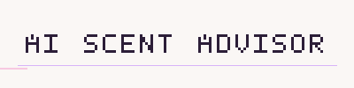

<p align="center">
  
</p>
<p align="center">
  
</p>

# AI Scent Advisor

An enterprise-grade, state-managed conversational recommendation system that guides users to their perfect fragrance using LangGraph state machines, MongoDB, and the Sarvam AI large language model.

---

## Conversational System Overview

The AI Scent Advisor is an interactive, multi-turn conversational web application designed to narrow down user preferences for fragrances. Built with a Django backend and MongoDB Atlas, it implements a compiled state machine workflow via LangGraph to route dialogue turns, extract accords, query the product database, handle general scent queries, and format matching recommendations.

---

## Olfactory Navigation Challenges

Navigating the world of perfumery is overwhelming due to thousands of choices and complex olfactory terminology (e.g., sillage, dry-down, base notes). Users frequently struggle to find fragrances because:
- Search engines rely on exact keyword matches rather than semantic scent preferences.
- Off-the-shelf LLMs lack real-time catalog access, leading to hallucinations of non-existent or discontinued perfumes.
- Conversational context easily drifts or breaks during complex, multi-turn queries.

---

## Advisor Objectives

- Design a structured state-machine dialog tree to handle user interactions without losing track of current filters (gender, brand, disliked ingredients).
- Implement a semantic accord-mapping translator that maps simple terms (e.g., orange, lemon) to standardized accords (e.g., Citrus).
- Develop a database query interface translating natural language requests into complex MongoDB parameters.
- Provide a robust exception-handling layer ensuring context continuity during LLM timeouts or network disruptions.

---

## Core System Features

- **LangGraph State Orchestration**: Structured routing via compiled state transitions.
- **Dynamic Accord Ingestion**: Auto-translates custom inputs to catalog categories.
- **Resilient Fallback Middleware**: Preserves turn counters and state variables if model services fail.
- **Multilingual Localization**: Detects regional scripts (Tamil, Hindi) and switches UI text automatically.
- **Interactive Prompt-Pills**: Auto-extracts bracketed keywords from text and displays them as clickable buttons.
- **Side-by-Side Glassmorphic Workspace**: Split layout for conversational chat and matching catalog products.

---

## Olfactory Tech Stack

- **Backend**: Python 3.13, Django 6.0, Django REST Framework, LangGraph, PyMongo
- **Frontend**: HTML5, Vanilla CSS3 (Custom Variables), JavaScript (ES6)
- **Database**: MongoDB (Local Instance / Atlas Cloud)
- **AI Integrations**: Sarvam AI API (Sarvam-30b model adapter)

---

## Graph Architecture & State Routing


---

## Repository Layout

```text
fragrance_project/
├── chatbot/                    # Django application containing conversational logic
│   ├── graph.py                # LangGraph workflow state machine definition and nodes
│   ├── urls.py                 # REST API routing patterns
│   ├── utils.py                # Database helper clients, ingestion functions, and API adapters
│   └── views.py                # Django views wrapping graph execution
├── data/                       # Dataset directory
│   └── fragrances.csv          # Catalog containing fragrance names, brands, and notes
├── fragrance_project/          # Root configurations
│   ├── settings.py             # Security, static files, and application definitions
│   └── urls.py                 # Main URL router mapping view assets
├── static/                     # Assets assets
│   ├── pixel_banner.png        # Header retro visual banner
│   ├── title_banner.png        # Header title gradient banner
│   ├── css/index.css           # Glassmorphic visual stylesheet
│   └── js/index.js             # Async communication interface
├── templates/                  # Base document markups
│   └── index.html              # Primary viewport containing layout columns
├── manage.py                   # Administrative entry point
└── requirements.txt            # System dependencies manifest
```

---

## System Deployment Guide

### Setup Prerequisites

- Python 3.10+
- MongoDB instance (Local community edition or MongoDB Atlas URL)
- Sarvam AI API Access Key

### Environment Variables (.env)

Create a file named `.env` in the root folder of the project:

```env
MONGO_URI=mongodb+srv://<username>:<password>@<cluster>.mongodb.net/?retryWrites=false
SARVAM_API_KEY=your_sarvam_api_key_here
```

### Installation Steps

1. **Clone the Repository**
   ```bash
   git clone https://github.com/mahimaapriyadharshinis/fragrance-advisor-project.git
   cd fragrance-advisor-project
   ```

2. **Initialize Environment & Install Packages**
   ```bash
   python -m venv venv
   source venv/bin/activate  # On Windows: .\venv\Scripts\activate
   pip install -r requirements.txt
   ```

3. **Ingest Fragrance Database**
   Start the Django local development server:
   ```bash
   python manage.py runserver
   ```
   Execute a HTTP POST request targeting `/api/ingest/` (using Postman or curl) to parse and load `data/fragrances.csv` into MongoDB.

---

## Ingestion & Dialogue Execution

1. Start the Django backend server:
   ```bash
   python manage.py runserver
   ```
2. Navigate to `http://127.0.0.1:8000/` in a web browser.
3. Chat with the Scent Advisor to refine your choices. You can click on the dynamic prompt pills (bracketed suggestions) to choose pre-configured paths, or type raw messages detailing the brands and scent notes you prefer or dislike.

---

## Conversational API Reference

### Chatbot Dialogue Endpoint

- **URL**: `/api/chat/`
- **Method**: `POST`
- **Payload**:
  ```json
  {
    "message": "I want a citrus fragrance from Chanel",
    "history": [],
    "recommended_perfumes": [],
    "other_perfumes": [],
    "brand_filter": null,
    "disliked_perfumes": [],
    "sort_by_best": false,
    "user_turns": 0
  }
  ```
- **Response**:
  ```json
  {
    "bot_reply": "I found several options containing Citrus notes for you. Would you like to view [Chanel Bleu]?",
    "recommended_products": [
      {
        "name": "Bleu de Chanel",
        "brand": "Chanel",
        "notes": "citrus, grapefruit, mint",
        "rating": 4.8
      }
    ],
    "other_products": [],
    "brand_filter": "Chanel",
    "disliked_perfumes": [],
    "sort_by_best": false,
    "user_turns": 1
  }
  ```

---

## MongoDB Document Schema & Data Pipelines

Fragrance entities are stored inside the `fragrances` collection within MongoDB.

```json
{
  "_id": "ObjectId",
  "name": "String",
  "brand": "String",
  "notes": "String",
  "rating": "Double",
  "gender": "String",
  "accords": "Array [String]"
}
```

**Data Flow Sequence**:
1. User input is validated at `/api/chat/`.
2. State is loaded into the `AgentState` struct.
3. LangGraph determines intent and targets the correct node.
4. Queries search the database utilizing regex filters matching target criteria.
5. Search results are filtered to exclude items in `disliked_perfumes`.
6. Recommended matches are set in the state, and the response is serialized back to the frontend.

---

## LangGraph Workflow & Sarvam AI Model Configuration

- **Core Model**: Sarvam AI API (Sarvam-30b model wrapper).
- **Orchestration**: LangGraph StateGraph compiling nodes into a structured workflow:
  - `chat`: Greets users and handles conversational dialogue.
  - `decline`: Catches out-of-scope or unrelated inputs.
  - `new_search`: Flushes state variables to start fresh recommendations.
  - `recommend`: Maps notes, extracts gender/brand profiles, and Queries MongoDB.
  - `db_qa`: Parses natural-language questions about catalog data and rating metrics.
  - `general_qa`: Resolves terminology and general scent classification concerns.

---

## Sample Dialogue Scenarios

- **Input**: "I hate sweet fragrances and want something fresh."
- **State Updated**: `disliked_perfumes` appended with "sweet".
- **Output**: "No problem! I have excluded sweet fragrances from your advisor search. How about a fresh wood or green tea scent?"

---

## Benchmark Performance

- **Context Retention**: Maintains user preferences up to 8 conversation turns without losing tracking variables.
- **Latency**: Under 1.5 seconds average latency per conversational cycle utilizing Sarvam AI streaming endpoints.

---

## Project Acknowledgements

- Sarvam AI Team for model API support.
- LangGraph developers for state-management frameworks.

---

## Project License

This project is licensed under the MIT License - see the `LICENSE` file for details.


