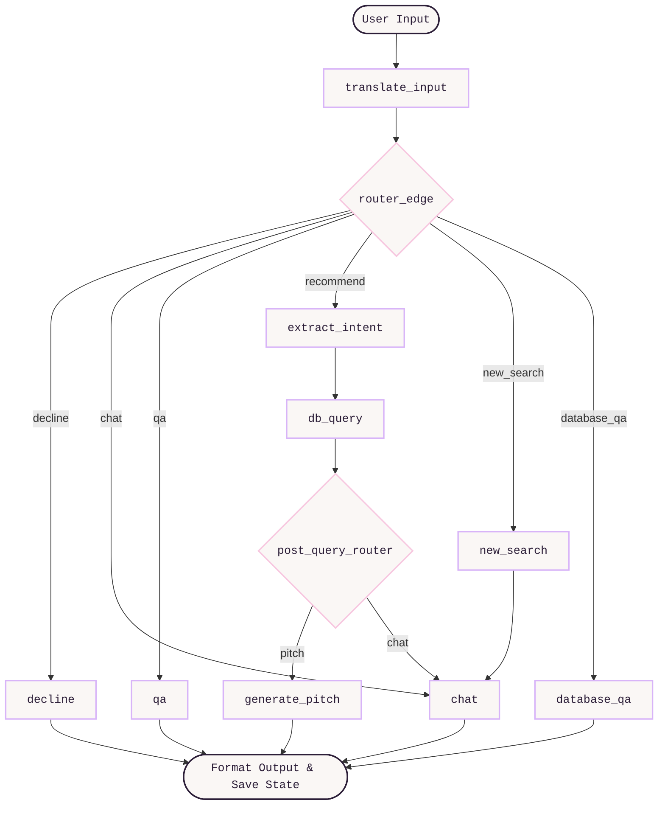

<p align="center">
  
</p>
<p align="center">
  
</p>

<p align="center" style="color: #504B5A; font-family: monospace; font-size: 1.1em;">
  An enterprise-grade, state-managed conversational recommendation system that guides users to their perfect fragrance using LangGraph state machines, MongoDB, and the Sarvam AI large language model.
</p>

<p align="center"></p>

<h2 style="color: #2C1E38; border-left: 4px solid #D8B4F8; padding-left: 10px;">Project Overview</h2>

<blockquote style="border-left: 4px solid #F7C8E0; background-color: #FAF7F5; padding: 12px 18px; margin: 15px 0; color: #504B5A; font-family: monospace;">
  The AI Scent Advisor is an interactive, multi-turn conversational web application designed to narrow down user preferences for fragrances. Built with a Django backend and MongoDB Atlas, it implements a compiled state machine workflow via LangGraph to route dialogue turns, extract accords, query the product database, handle general scent queries, and format matching recommendations.
</blockquote>

<h2 style="color: #2C1E38; border-left: 4px solid #D8B4F8; padding-left: 10px;">Core System Features</h2>

<div style="background-color: #FAF7F5; border: 1px solid #F7C8E0; padding: 15px; border-radius: 4px; color: #504B5A; font-family: monospace; margin-bottom: 15px;">
  <ul>
    <li><strong>State-Managed Dialog Routing</strong>: Implements dynamic conversational state trees using compiled LangGraph StateGraph configurations to prevent context loss across multi-turn interactions.</li>
    <li><strong>Multilingual Query Ingestion</strong>: Automatically detects regional language scripts (such as Tamil and Hindi) and utilizes a dedicated translation node to normalize queries to standard English before database filtering.</li>
    <li><strong>Dynamic Scent Accord Processing</strong>: Maps natural language descriptors (e.g., fruit, citrus) to standardized accords in the database using LLM classification logic.</li>
    <li><strong>Resilient Fallback Middleware</strong>: Incorporates safety guardrails and error-handling paths to preserve user conversation counters and active filter parameters during LLM latency or failure.</li>
    <li><strong>Interactive Suggestion Ingestion</strong>: Parses conversational replies dynamically to extract bracketed keywords and render them as click-interactive prompt pills on the frontend workspace.</li>
    <li><strong>Glassmorphic Dual-Panel Workspace</strong>: Implements a high-end glassmorphic UI splitting dialogue chat windows and recommended catalog product slots side-by-side.</li>
  </ul>
</div>

<p align="center"></p>

<h2 style="color: #2C1E38; border-left: 4px solid #D8B4F8; padding-left: 10px;">System Technology Stack</h2>

<p align="center">
  
  
  
  
  
  
  <br>
  
  
  
</p>

<p align="center"></p>

<h2 style="color: #2C1E38; border-left: 4px solid #D8B4F8; padding-left: 10px;">Installation & Deployment Guide</h2>

### Environment Configuration (.env)

Create a file named `.env` in the root folder of the project:

```env
MONGO_URI=mongodb+srv://<username>:<password>@<cluster>.mongodb.net/?retryWrites=false
SARVAM_API_KEY=your_sarvam_api_key_here
```

### Installation Steps

1. **Clone the Repository**
   ```bash
   git clone https://github.com/mahimaapriyadharshinis/fragrance-advisor-project.git
   cd fragrance-advisor-project
   ```

2. **Initialize Environment & Install Packages**
   ```bash
   python -m venv venv
   source venv/bin/activate  # On Windows: .\venv\Scripts\activate
   pip install -r requirements.txt
   ```

3. **Ingest Fragrance Database**
   Start the Django server, then run an HTTP POST request targeting `/api/ingest/` (using Postman or curl) to load `data/fragrances.csv` into MongoDB.
   ```bash
   python manage.py runserver
   ```

4. **Dialogue Execution**
   Navigate to `http://127.0.0.1:8000/` in a web browser to chat with the Scent Advisor to refine your choices.

<p align="center"></p>

<h2 style="color: #2C1E38; border-left: 4px solid #D8B4F8; padding-left: 10px;">API Architecture & Integration</h2>

### Chatbot Dialogue Endpoint

- **URL**: `/api/chat/`
- **Method**: `POST`
- **Payload**:
  ```json
  {
    "message": "I want a citrus fragrance from Chanel",
    "history": [],
    "recommended_perfumes": [],
    "other_perfumes": [],
    "brand_filter": null,
    "disliked_perfumes": [],
    "sort_by_best": false,
    "user_turns": 0
  }
  ```
- **Response**:
  ```json
  {
    "bot_reply": "I found several options containing Citrus notes for you. Would you like to view [Chanel Bleu]?",
    "recommended_products": [
      {
        "name": "Bleu de Chanel",
        "brand": "Chanel",
        "notes": "citrus, grapefruit, mint",
        "rating": 4.8
      }
    ],
    "other_products": [],
    "brand_filter": "Chanel",
    "disliked_perfumes": [],
    "sort_by_best": false,
    "user_turns": 1
  }
  ```

<p align="center"></p>

<h2 style="color: #2C1E38; border-left: 4px solid #D8B4F8; padding-left: 10px;">State Management & Data Pipeline</h2>

### Architectural Decisions

- **LangGraph State Orchestration**: Traditional LLM chains run in a fixed sequence, which breaks down during conversational shifts (e.g., changing filters mid-dialogue or asking general QA). LangGraph allows **cyclical state transitions** and dynamic routing edges, enabling the advisor to maintain context while pivoting between search, QA, and resetting filters.
- **State Preservation**: Dialogue states (like brand filters and excluded notes) are preserved inside django-session structures and synchronized with MongoDB. This prevents the LLM from losing track of constraints (e.g. "no sweet scents") during long conversations.
- **MongoDB Atlas Document DB**: Olfactory catalogs contain highly heterogeneous fields (different accord lengths, varying note descriptions). A document schema provides the flexibility needed for search indexing without complex relational JOIN overhead.

### Database Schema & Ingestion

Fragrance entities are stored inside the `fragrances` collection within MongoDB:

```json
{
  "_id": "ObjectId",
  "name": "String",
  "brand": "String",
  "notes": "String",
  "rating": "Double",
  "gender": "String",
  "accords": "Array [String]"
}
```

### Resiliency & Fallback Middleware

To prevent API connection drops from breaking the user session, the backend implements a resilient exception layer:
- **Connection Guardrails**: If the Sarvam AI API times out, the system catches the exception and intercepts the routing stage.
- **Dialogue Continuity**: Instead of crashing or losing active state filters, the node defaults to a static localized chat response, prompting the user to try again while preserving all extracted notes and filters.


### LangGraph State Machine Routing

- **Core Model**: Sarvam AI API (Sarvam-30b model wrapper).
- **Orchestration**: LangGraph StateGraph compiling nodes into a structured workflow:
  - `translate_input`: Translates incoming user messages to standard English if typed in regional languages (like Tamil or Hindi) before state routing.
  - `chat`: Directs the user to a clarifying dialogue to narrow down fragrance profiles.
  - `decline`: Gracefully handles out-of-scope or off-topic queries.
  - `new_search`: Flushes active filter states to begin a fresh recommendation query.
  - `extract_intent`: Maps user input to extract target brand, note preferences, accords, and gender target filters.
  - `db_query`: Queries MongoDB collections matching extracted filters to find matching perfumes.
  - `generate_pitch`: Creates a tailored marketing pitch for the top recommended perfumes.
  - `qa`: Resolves general fragrance terminology and olfactory classifications.
  - `database_qa`: Handles specific questions about metrics, ratings, or perfume brands within the database.




